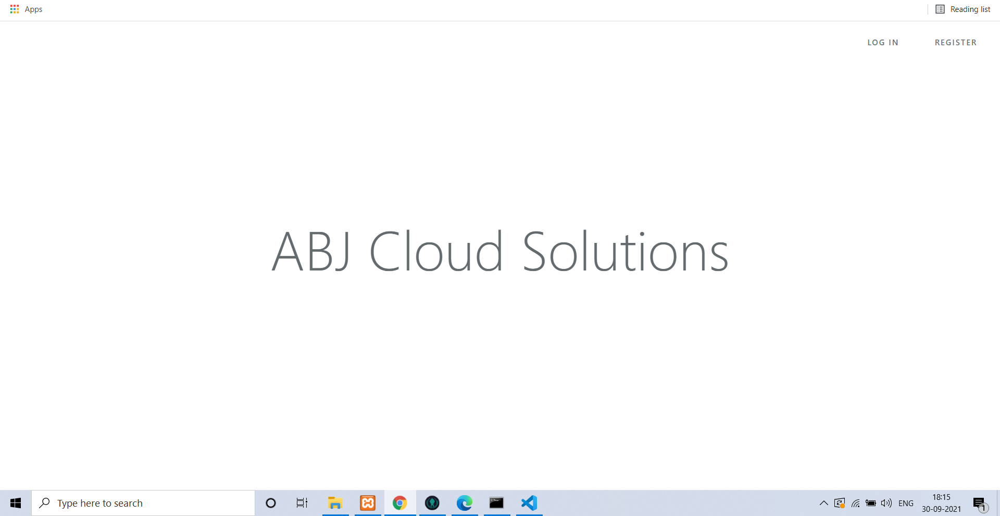
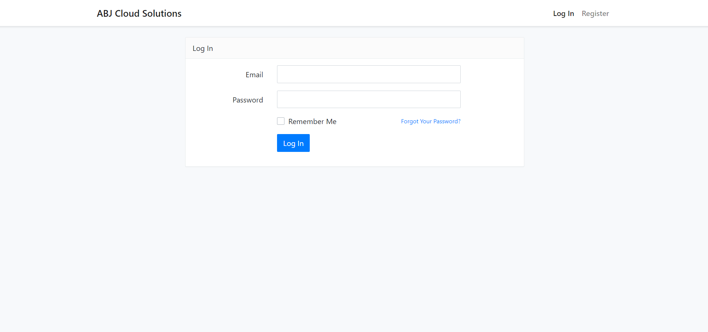
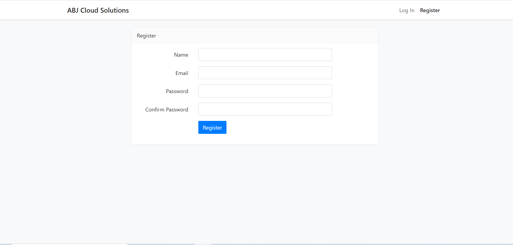
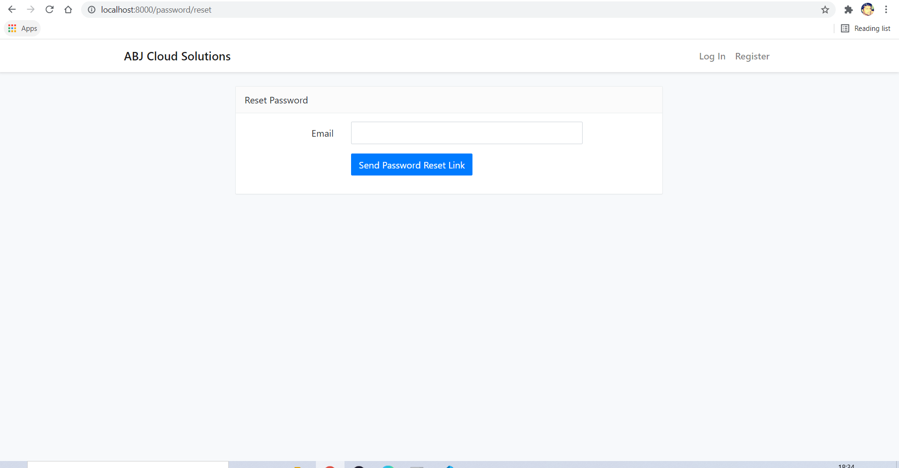
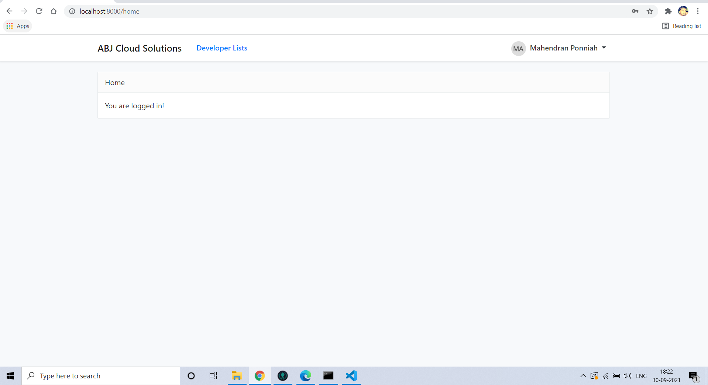
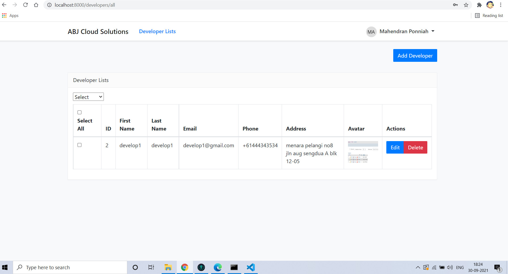
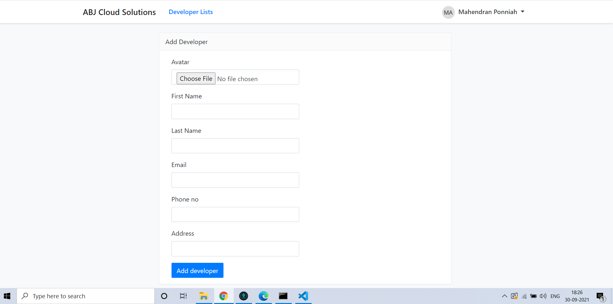
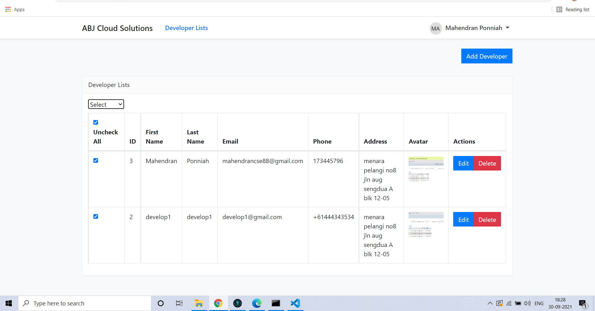

# abj cloud solutions 
 A abj-cloud-solutions starter kit.


## Installation

- `git clone https://github.com/mahendrancse88/abj-cloud-solutions.git`
- Edit `.env` and set your database connection details
- cd abj-cloud-solutions
- (When installed via git clone or download, run `php artisan key:generate` and `php artisan jwt:secret`)
- `php artisan migrate`
- `npm install`
- `php artisan serve`

## Usage

#### Development

```bash
# Build and watch
npm run watch

# Serve with hot reloading (not working)
npm run hot
```

#### Production

```bash
npm run production
```

## Testing

```bash
# Run unit and feature tests
vendor/bin/phpunit

# Run Dusk browser tests
php artisan dusk
```

#### OUTPUT ON Browser

# Home Page


# Login Page


# Register Page


# Forgot Password Page


# logged in Page


# developer lists Page


# add developer  Page


# multiple records deletion



## Changelog

Please see [CHANGELOG](CHANGELOG.md) for more information what has changed recently.
